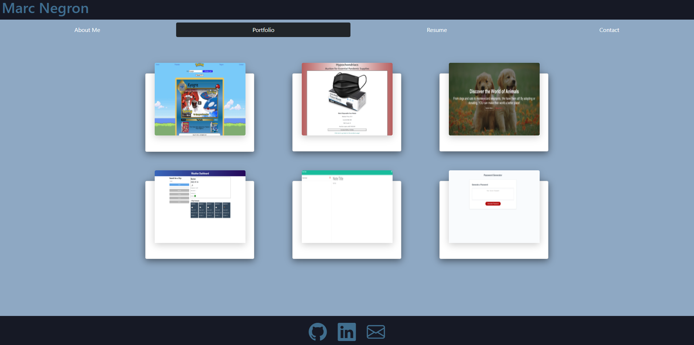

# React Portfolio

## Description

Web developers are a part of a community and need a place to share their projects while applying for jobs or working as a freelancer which is why creating a portfolio to display their skills is a must. My react portfolio allows me to have a space to display all my projects and also show my React skills.

## Table of Contents

- [Usage](#usage)
- [Technologies](#technologies)
- [Preview](#preview)
- [Launch](#launch)

## Technologies

- HTML
- CSS
- JavaScript
- Bootstrap
- React

## Preview

## Launch

[GitHub Pages](https://negronmarc.github.io/React-Portfolio/)
